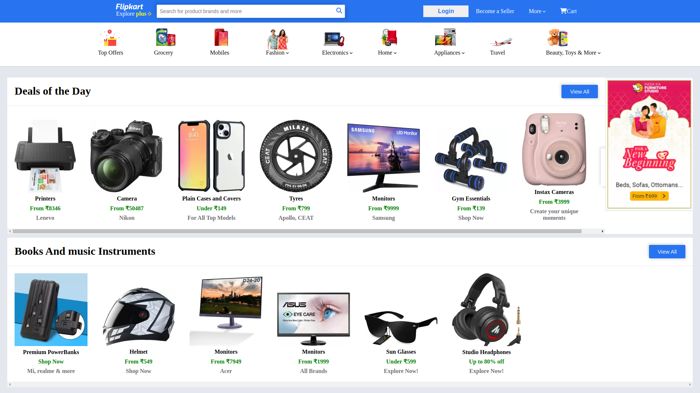
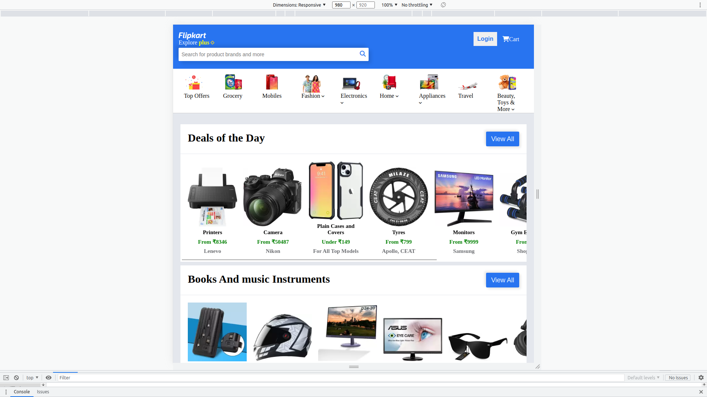
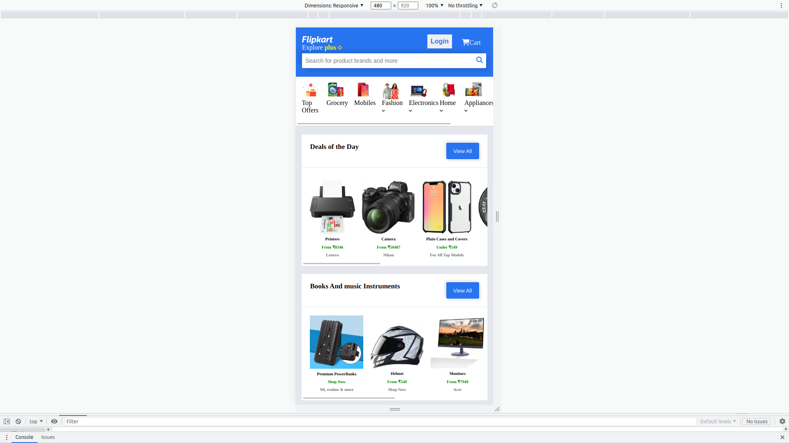

# Flipkart Page

## Submission By Sumit Singh Rajput

This is the web page of flipkart which is static and responsive

There are some screenshots of different resolution:-

<!DOCTYPE html>
<html lang="en">
<head>
    <meta charset="UTF-8">
    <meta http-equiv="X-UA-Compatible" content="IE=edge">
    <meta name="viewport" content="width=device-width, initial-scale=1.0">
</head>
<body>
  
  
  
</body>
</html>
